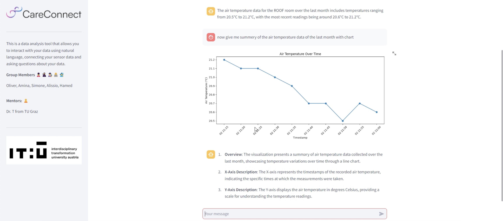
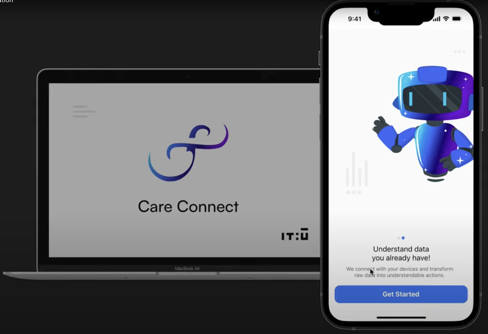
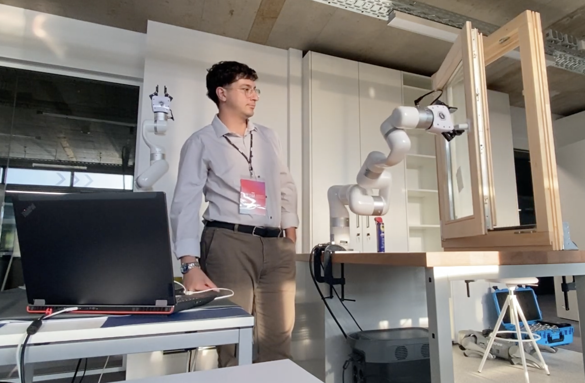

# Care Connect: Using LLMs to Improve Patient Care & Hospital Efficiency

### Copyright © 2024 Alessio Borgi, Simone Redl, Oliver Guy, Amina Tucaković, Hamed Kshiem

This project demonstrates an **AI-Driven System** for **querying environmental** data in a **hospital setting**, **generating real-time graphs**, **notifying** and **executing actions** based on the insights obtained. The system uses OpenAI’s GPT models (via **LangChain**) to interact with an SQLite database, create visualizations, and control hospital environmental conditions. The primary use case involves monitoring hospital rooms and rooftop sensor data, allowing staff to query information through natural language.  The system can also self-explain by providing insights derived from visualizations and recommending corresponding actions, allowing also the triggering of the movement of a robot arm. 

<p align="center">
  
</p>


### System Architecture Overview

The system consists of several integrated components that work together to handle data querying, processing, and visualization:

1. **LangChain & SQLite Database**
   	- LangChain serves as the interface to query the SQLite database, which holds environmental data for multiple hospital rooms and rooftop sensors.
	- Environmental parameters like temperature, humidity, and oxygen levels, for example, are stored in CSV files, which are regularly updated in the database.
	- The database includes multiple rooms (QRITA, QFOYER, QDORO, QHANS, QMOMO, QROB) and rooftop data.

3. **Request Engine (Agent Extractor & OpenAI)**
	- The Request Engine is powered by GPT-4o-mini and interprets natural language queries from hospital staff. The queries can range from specific questions like “What is the air quality in QRITA?” to complex requests like “Show me the temperature trends for the past week.”
	- The engine translates these queries into structured SQL queries that are executed on the SQLite database.
	- OpenAI’s ChatGPT-based models are used to generate SQL queries and perform more advanced reasoning tasks like determining trends or providing insights.

4. **Graph Plot Code Generation, Visualization & Explanation**
	- The system automatically generates Python code to create visualizations (e.g., line charts, bar graphs) based on the query results.
	- The visualizations typically show time-series data (e.g., temperature trends over a week). The system uses Matplotlib to plot the results and saves the charts as images for display in the user interface.
	- Visualizations are saved automatically in .png format and displayed to users in response to continuous queries (e.g., “What were the temperatures in QRITA for the last 7 days?”).
 	- The system is also able to self-explain, by providing insights derived from the visualization and the correspondent needed actions.

5. **Frontend**
	- The frontend allows hospital staff(e.g., nurses or facility managers) to interact with the system by submitting natural language queries.
	- The interface returns data either as text or as visualizations, depending on the nature of the query.
	- Users can query the environmental conditions of different rooms, compare data, or get insights into overall hospital environmental trends.

6. **Actions (Open/Close Windows)**
	- In addition to querying and visualization, the system can perform actions based on the results of the data, being able to integrate also the sensor ranges.
	- For example, if the air quality in a specific room is poor, the system can trigger actions like opening or closing windows with a Robot Arm to adjust the environment in real-time.

 You can here see an example of interaction with the **Juno ChatBot** we have built:
 <div style="text-align: center">
  <a href="https://www.youtube.com/watch?v=jyYGPEJGU4A">
    <p style="font-size: 16px; margin-top: 5px;">Click the Photo to See the Video!</p>
    
  </a>
</div>


 You can see the **Figma Application Browsing** clicking on the image:

<div style="text-align: center">
  <a href="https://www.youtube.com/watch?v=KBho37kmRm4">
    <p style="font-size: 16px; margin-top: 5px;">Click the Photo to See the Video!</p>
    
  </a>
</div>


 You can see the **Opening-Closing of a Window with a Robot Manipulator** by clicking on the image:

<div style="text-align: center">
  <a href="https://www.youtube.com/watch?v=M1Z9PJPd2Jw">
    <p style="font-size: 16px; margin-top: 5px;">Click the Photo to See the Video!</p>
    
  </a>
</div>

### Installation

1. **Clone the Repository**:
   bash
   ```
   git clone https://github.com/your-repository/hospital-environment-monitoring.git
   cd hospital-environment-monitoring
   ```
3. **Install Required Dependencies**:
   bash
   ```
   pip install -r requirements.txt
   ```
5. **Set Up OpenAI API Key**: Add your OpenAI API key in a file named oaikey.txt in the project root directory. ```YOUR_OPENAI_API_KEY```
6. **Prepare the Database**:
   - Ensure that you have the relevant CSV files containing environmental data. These files should be 	 
     placed in the corresponding directories ```(./MQTT Client/Room MQTT Client/data/)```.
   - The system will automatically create an SQLite database and populate it with this data when you run 
     the code.

### How to Run the System

1. **Run the Engine Script**: Execute the main script from within the './final' folder, to set up the OpenAI API key, create the SQLite database, and query the environmental data.
   bash
   ```
   python Engine.py
   ```
3. **Run the Streamlit Frontend Script**: Execute the frontend script, in a parallel terminal, from within the './final' folder .
   bash
   ```
   python -m streamlit run Frontend.py
   ```
5. **Sample Queries**: After starting the system, you can submit queries in natural language. For example:
 	- *"Please provide the air quality."*
   	- *"Show me the air temperature trends for the last 7 days."*
	- *"What was the average solar radiation in the past year?"*
6. **Graph Visualization**: If your query returns a time-series dataset, the system will generate a graph automatically and save it as a .png image. These graphs will be displayed directly on the frontend.


   
